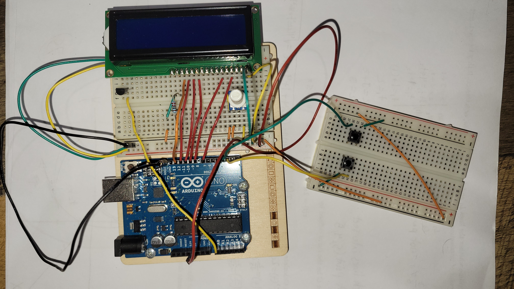

# <Project Name>

LCD Temperature Display with Two Button Menu (debouncing + state machine)

## Demo
**Celsius view**

**Fahrenheit view**

## Features
- Feature 1 (what the user sees)
- Feature 2
- Feature 3

## Hardware
- Arduino: Uno
- Sensor: TMP36
- Display: 16x2 LCD
- Inputs: 2x buttons, Potentiometer
- Misc: 220 Ohm resistor

## Wiring

## How to Run
1. Open temp-display-menu.ino in Arduino IDE
2. Select Arduino Uno and Port
3. Upload to the Arduino
4. Use buttons to navigate pages

